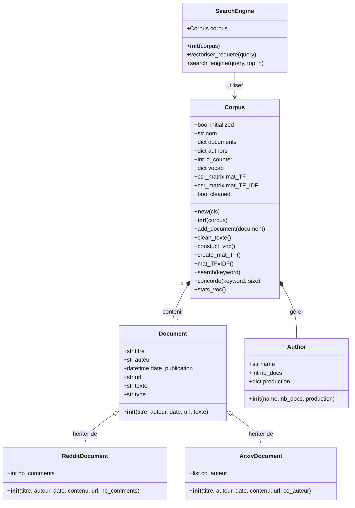

# Moteur de Recherche (Reddit & Arxiv)

## Spécification

Ce projet consiste à développer un moteur de recherche d'information sans utiliser de bibliothèques comme scikit-learn ou NLTK. Il collecte des données textuelles depuis Reddit et Arxiv pour construire un corpus et permettre des recherches basées sur la similarité textuelle (TF-IDF).

**Collecte de données** : Extraire des documents textuels depuis Reddit (via l'API praw) et Arxiv (via urllib et xmltodict) sur une thématique spécifique.

**Organisation du Corpus** : Structurer les textes récoltés dans une collection, en associant chaque document à son auteur et à ses métadonnées d'origine (titre, url, date...).

**Indexation et Recherche** : Transformer les documents en représentations vectorielles (TF-IDF) pour permettre une recherche par similarité cosinus, sans utiliser de bibliothèques de TAL pré-existantes comme NLTK ou scikit-learn.

**Interface Utilisateur** : Fournir un accès simplifié aux fonctionnalités via un Notebook interactif.

## Analyse

### Environnement de travail

**IDE** : VS Code est l’outil central du projet. Il regroupe toutes les fonctionnalités nécessaires : gestion native de GitHub, rédaction de documents Markdown convertis ensuite en PDF, développement polyglotte (JS par exemple) et intégration de Jupyter Notebook pour tester le code par blocs.

**Gestion du code** : GitHub. Cette plateforme assure le versionnage du code. Elle simplifie la reprise du projet sur différents PC et structure la progression grâce au système de tags (v1, v2 et v3).

**Dépendances** : venv & pip. L'environnement virtuel (venv) isole le projet et supprime tout risque de conflit entre bibliothèques. Le fichier requirements.txt réinstalle directement l'intégralité des dépendances. Le projet s'appuie sur :
- **numpy et scipy** pour les calculs matriciels et la gestion des matrices creuses (csr_matrix).
- **pandas** pour structurer et manipuler les données.
- **praw** et xmltodict pour extraire les données depuis les APIs Reddit et Arxiv.

### Données identifiées

Le moteur extrait ses données de deux APIs : Reddit et Arxiv. Chaque document possède un socle commun de caractéristiques regroupées dans la classe Document :
- **Titre** : Intitulé de la publication ou de l'article
- **Date de publication** : Date précise de mise en ligne
- **Auteur** : Identifiant du créateur principal
- **Texte** : Contenu textuel lié au sujet (corps du post ou résumé de l'article)
- **URL** : Lien direct vers l'article

En plus de ces bases, le programme récupère des métadonnées spécifiques à la nature de chaque plateforme :
- **Sur Reddit (RedditDocument)** : Le nombre de commentaires car Reddit est un réseau social 
- **Sur Arxiv (ArxivDocument)**: La liste des co-auteurs car les articles scientifiques sont rédigés à plusieurs

### Diagramme des classes

### La Conception
Partage des tâches

Le développement a été structuré par phases correspondant aux versions du projet :

    v1 (TD 3-5) : Mise en place du socle de base (scrapers Reddit/Arxiv, architecture des classes de documents et gestion du corpus).

    v2 (TD 3-7) : Implémentation de la logique de recherche (nettoyage de texte, construction du vocabulaire, calculs matriciels TF et TF-IDF).

    v3 (TD 3-10) : Finalisation avec l'interface Notebook et intégration d'extensions (gestion des datasets externes comme discours_US.csv).

Algorithmes spécifiques

L'élément le plus complexe réside dans le calcul de la pertinence via TF-IDF :

    TF (Term Frequency) : Calculé pour chaque mot dans chaque document au sein de la matrice creuse mat_TF.

    IDF (Inverse Document Frequency) : Calculé comme log(N/(df+1)), où N est le nombre total de documents et df le nombre de documents contenant le mot.

    Similarité Cosinus : Calculée par le produit scalaire du vecteur requête et du vecteur document, divisé par le produit de leurs normes.

Problèmes rencontrés et solutions

    Pattern Singleton : Pour éviter de dupliquer le corpus en mémoire, nous avons implémenté la méthode __new__ dans Corpus pour garantir l'unicité de l'instance.

    Matrices volumineuses : Le vocabulaire pouvant être très large, l'utilisation de csr_matrix (matrice creuse) de scipy a permis d'optimiser l'espace mémoire et la rapidité des calculs.

Exemple d'utilisation

    Initialisation du corpus : sujet_corpus = Corpus("MachineLearning").

    Chargement des données : sujet_corpus.load("MachineLearning_corpus.pkl").

    Recherche : L'utilisateur saisit "deep learning".

    Traitement : Le moteur vectorise la requête et retourne les 10 meilleurs résultats classés par score de similarité.

## La Validation
Tests unitaires

Les méthodes ont été testées individuellement pour valider leur comportement :

    Nettoyage : Vérification que clean_texte() supprime bien la ponctuation et les URLs.

    Scraping : Les scripts scrapping_arxiv.py et scrapping_reddit.py comportent des blocs __main__ pour tester l'extraction sur un petit échantillon avant intégration.

Tests globaux

Via l'interface Notebook, plusieurs cas ont été testés :

    Requêtes vides : Vérification que le système gère l'absence de mots-clés sans planter.

    Mots inconnus : Le système renvoie un message indiquant qu'aucun mot de la requête n'est présent dans le vocabulaire.

    Datasets externes : Test de robustesse avec le fichier discours_US.csv pour vérifier que le moteur reste fonctionnel sur d'autres types de textes.

## La Maintenance
Évolutions possibles

    Optimisation TAL : L'intégration d'un algorithme de "stemming" (racinisation) permettrait de regrouper les mots de même racine (ex: "learning" et "learn") pour améliorer la pertinence.

    Nouvelles sources : L'ajout de scrapers pour Twitter/X ou Mastodon est facilité par l'architecture d'héritage de la classe Document.

    Performance : Pour des corpus dépassant les 100 000 documents, il serait nécessaire d'utiliser des outils d'indexation inversée plus avancés, car le calcul de similarité sur l'ensemble de la matrice deviendrait coûteux en temps réel.