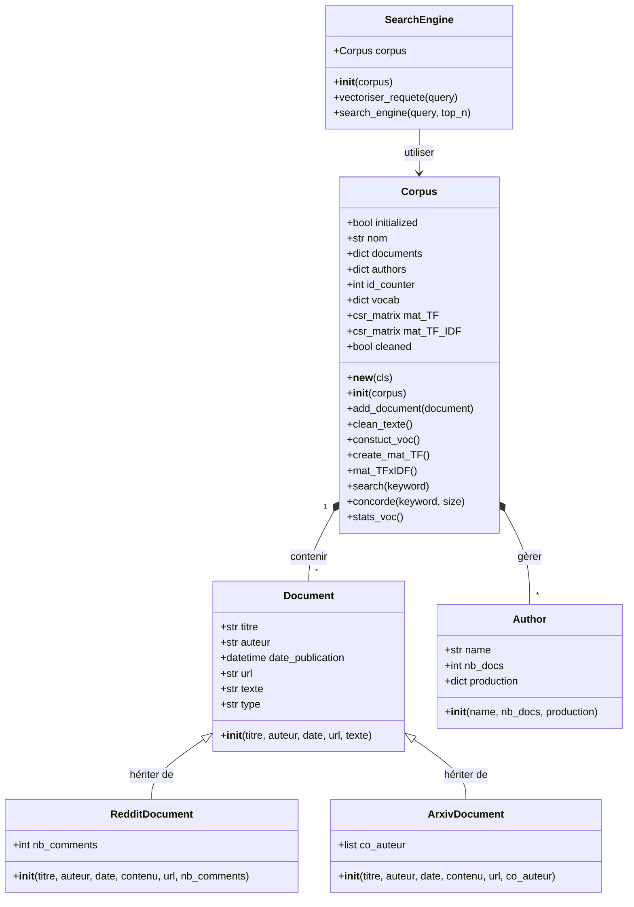

# Moteur de Recherche (Reddit & Arxiv)

**Auteur :** David TRUONG
**Dépôt GitHub :** [https://github.com/0TRDavid/Search_engine](https://github.com/0TRDavid/Search_engine)

## Spécification

Ce projet consiste à développer un moteur de recherche d'information sans utiliser de bibliothèques comme scikit-learn ou NLTK. Il collecte des données textuelles depuis Reddit et Arxiv pour construire un corpus et permettre des recherches basées sur la similarité textuelle (TF-IDF).

**Collecte de données** : Extraire des documents textuels depuis Reddit (via l'API praw) et Arxiv (via urllib et xmltodict) sur une thématique spécifique.

**Organisation du Corpus** : Structurer les textes récoltés dans une collection, en associant chaque document à son auteur et à ses métadonnées d'origine (titre, url, date...).

**Indexation et Recherche** : Transformer les documents en représentations vectorielles (TF-IDF) pour permettre une recherche par similarité cosinus, sans utiliser de bibliothèques de TAL pré-existantes comme NLTK ou scikit-learn.

**Interface Utilisateur** : Fournir un accès simplifié aux fonctionnalités via un Notebook interactif.

## Analyse

### Environnement de travail

**IDE** : VS Code est l’outil central du projet. Il regroupe toutes les fonctionnalités nécessaires : gestion native de GitHub, rédaction de documents Markdown convertis ensuite en PDF, développement polyglotte (JS par exemple) et intégration de Jupyter Notebook pour tester le code par blocs.

**Gestion du code** : GitHub. Cette plateforme assure le versionnage du code. Elle simplifie la reprise du projet sur différents PC et structure la progression grâce au système de tags (v1, v2 et v3).

**Dépendances** : venv & pip. L'environnement virtuel (venv) isole le projet et supprime tout risque de conflit entre bibliothèques. Le fichier requirements.txt réinstalle directement l'intégralité des dépendances. Le projet s'appuie sur :
- **numpy et scipy** pour les calculs matriciels et la gestion des matrices creuses (csr_matrix).
- **pandas** pour structurer et manipuler les données.
- **praw** et xmltodict pour extraire les données depuis les APIs Reddit et Arxiv.

### Données identifiées

Le moteur extrait ses données de deux APIs : Reddit et Arxiv. Chaque document possède un socle commun de caractéristiques regroupées dans la classe Document :
- **Titre** : Intitulé de la publication ou de l'article
- **Date de publication** : Date précise de mise en ligne
- **Auteur** : Identifiant du créateur principal
- **Texte** : Contenu textuel lié au sujet (corps du post ou résumé de l'article)
- **URL** : Lien direct vers l'article

En plus de ces bases, le programme récupère des métadonnées spécifiques à chaque plateforme :
- **Sur Reddit (RedditDocument)** : Le nombre de commentaires car Reddit est un réseau social 
- **Sur Arxiv (ArxivDocument)**: La liste des co-auteurs car les articles scientifiques sont rédigés à plusieurs

### Diagramme des classes

### La Conception

### Partage des tâches
Le projet a été découpé en différentes versions :
- **v1 (TD 3-5)** : Mise en place du socle de base (scrapers Reddit/Arxiv, architecture des classes de documents et gestion du corpus).
- **v2 (TD 3-7)** : Implémentation de la logique de recherche (nettoyage de texte, construction du vocabulaire, calculs matriciels TF et TF-IDF).
- **v3 (TD 3-8)** : Finalisation avec l'interface Notebook et intégration d'extensions (gestion des datasets externes comme discours_US.csv).

Pour l'organisation du code sur GitHub :
- J'utilise des tags et des releases pour isoler et récupérer directement les versions v1 et v2.
- La version finale (v3) est disponible sur la branche main.

### Algorithme
Pour transformer des posts Reddit ou des articles Arxiv en résultats de recherche, je suis une logique mathématique découpée en plusieurs étapes techniques.

#### Le Nettoyage (corpus.clean_texte())
Avant de compter les mots, je dois les rendre "propres". Si je laisse les majuscules ou la ponctuation, l'ordinateur croit que "Robot" et "robot!" sont deux mots différents.
- *Ce que je fais* : Je passe tout en minuscules, je supprime les URLs, la ponctuation et les espaces inutiles.
- **Résultat** : Je récupère un texte brut où chaque mot est standardisé.

#### Le Vocabulaire et la Matrice TF (corpus.constuct_voc() et corpus.create_mat_TF())
Une fois le texte propre, je crée un dictionnaire (le vocabulaire) qui liste tous les mots uniques rencontrés dans tous les documents. Chaque mot reçoit un numéro d'identifiant.
- **Le comptage (TF)** : Je compte combien de fois chaque mot du dictionnaire apparaît dans chaque document.
- **Le problème des zéros** : Comme un texte ne contient qu'une minuscule partie de tous les mots existants, ma matrice est remplie de zéros. Pour ne pas saturer la mémoire vive, j'utilise une matrice creuse (Sparse Matrix) : je ne stocke que les cases qui contiennent vraiment une information.

#### Le TF-IDF : l'importance des mots (corpus.mat_TFxIDF())
Compter ne suffit pas. Le mot "le" apparaît partout mais ne sert à rien pour la recherche. J'utilise donc le score TF-IDF pour donner du poids aux mots vraiment importants :
- **Matrice TF (Term Frequency)** : Le mot est-il fréquent dans ce document précis ?.
- **Matrice IDF (Inverse Document Frequency)** : Le mot est-il rare dans l'ensemble du corpus ?.
- **Logique** : Un mot rare globalement (comme "NoSQL") qui apparaît dans un texte devient très lourd dans le calcul, alors qu'un mot commun perd tout son poids.

#### La Recherche et le Score de Ressemblance (SearchEngine.vectorise_request() et SearchEngine.search_engine())
Quand l'utilisateur tape une requête, le moteur la traite exactement comme un nouveau document.
- **Vectorisation** : Je nettoie la requête et je la transforme en une liste de chiffres (un vecteur) basée sur mon vocabulaire.
- **Similarité Cosinus** : Je compare l'angle entre le vecteur de la requête et celui de chaque document. C'est ce qui donne le "score de ressemblance".
- **Classement** : Je trie les documents du score le plus haut (100%) au plus bas et je sors les 10 plus pertinents.

### Problèmes rencontrés et solutions 

**La galère du TF-IDF et de NumPy**: Au début, j'ai vraiment eu du mal à capter comment passait l'algorithme de la théorie au code. Je gère bien Pandas pour les tableaux classiques, mais NumPy c’était nouveau pour moi. J'ai passé beaucoup de temps à comprendre comment transformer mes mots en vecteurs de chiffres.

**Le bazar dans les dossiers**: Sur la v1 et la v2, mon projet était mal organisé, je m'y perdais dans mes fichiers. Depuis que j'utilise React, j'ai appris à bien séparer les responsabilités.

**Solution** : J'ai appliqué la logique React à mon dossier src. J'ai créé un dossier scrapers/ pour la récupération de données et un dossier doc/ pour mes classes de modèles. Cette structure "propre" m'a permis de coder la suite (le moteur de recherche) beaucoup plus facilement sans tout casser à chaque fois.

### Exemple d'utilisation

Pour faire fonctionner le programme, je suis un enchaînement précis dans mon fichier main.py :
**Initialisation du corpus** : Je commence par créer mon objet Corpus en lui donnant le nom du sujet que je traite (par exemple "NoSQL").
**Gestion des données (2 modes)** :
- **Le mode "Scrapping"**: Si je n'ai pas encore de données, je lance ma fonction save_corpus. Elle interroge les APIs de Reddit et Arxiv, transforme chaque retour en objet Document, les ajoute au corpus et sauvegarde le tout dans un fichier Pickle (.pkl).
- **Le mode "Chargement"** : Pour éviter de refaire tout ce travail à chaque fois, j'utilise la fonction load_corpus. Elle récupère directement mon fichier .pkl et remet tout en mémoire en un instant.

**Lancement du moteur** : Une fois que le corpus est chargé avec ses documents, j'initialise ma classe SearchEngine en lui passant mon objet corpus.

**La recherche**:
- L'utilisateur saisit sa requête (par exemple : "deep learning").
- Le moteur nettoie cette phrase et la vectorise (il la transforme en liste de chiffres TF-IDF).
- Il calcule ensuite le score de similarité entre ce vecteur et tous les articles de ma base.
- Enfin, il m'affiche les 10 meilleurs résultats, classés du plus pertinent au moins pertinent avec leur score de ressemblance.

## La Validation

### Tests unitaires
En toute honnêteté, je n'ai pas utilisé de bibliothèque spécialisée comme **pytest** car c'est un domaine que je ne maîtrise pas encore. À la place, j'ai réalisé tous mes tests manuellement, ligne par ligne, directement dans le bloc if __name__ == "__main__": de mes fichiers.
- **Vérification des scrapers** : J'ai testé chaque fonction de récupération de données (scrapping_reddit et scrapping_arxiv) en isolant les appels et en affichant les premiers résultats pour vérifier que les champs (titre, auteur, texte) étaient bien remplis.
- **Test du Singleton** : J'ai vérifié dans le main.py que ma classe Corpus ne créait pas de doublons en mémoire en comparant deux instances.
- **Nettoyage** : J'ai testé la fonction clean_texte sur des échantillons pour m'assurer que les URLs et la ponctuation disparaissaient bien sans supprimer le texte important.

### Tests globaux

Pour les tests de l'application complète, je me suis concentré sur la robustesse du moteur de recherche via l'interface :
- **Mots inconnus** : Si l'utilisateur tape un mot qui n'est pas dans le dictionnaire, le système ne plante pas. Il calcule que le vecteur de la requête est nul et renvoie un message propre indiquant que le mot n'appartient pas au vocabulaire du corpus.
- **Requêtes vides** : J'ai testé le comportement face à une recherche vide pour vérifier que l'algorithme de similarité cosinus gère bien l'absence de données sans générer d'erreurs mathématiques.
- **Tri des résultats** : J'ai vérifié manuellement que les articles qui ressortent en premier sont bien ceux qui contiennent le plus de mots-clés de la requête, validant ainsi mon calcul de score.

## La Maintenance

- **Nouvelles sources de données** : J'ai passé beaucoup de temps à bien structurer le code et les dossiers pour que le projet soit évolutif. Grâce à l'organisation actuelle, si on veut ajouter une nouvelle source (comme Twitter), c'est très simple : il suffit de créer une nouvelle classe dans le dossier ./src/doc qui hérite de Document et d'ajouter son script dans ./src/scrapers. Le reste du moteur de recherche n'aura pas besoin d'être modifié pour intégrer ces nouvelles données.

- **Passage en App Web** : Pour l'instant, l'interface tourne sur Jupyter Notebook pour la démonstration. Mais comme toute la logique du moteur de recherche est bien isolée dans la classe SearchEngine, on pourra facilement transformer ce code en un véritable backend avec un framework comme Django. Cela permettrait de passer d'un notebook à un vrai site web fonctionnel, un peu comme un "Google".
